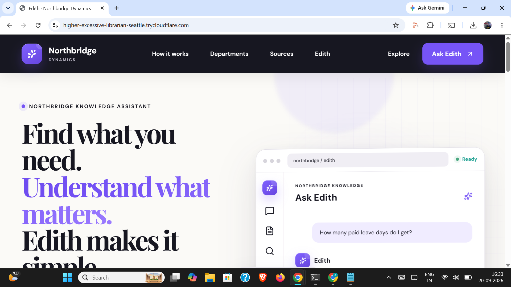
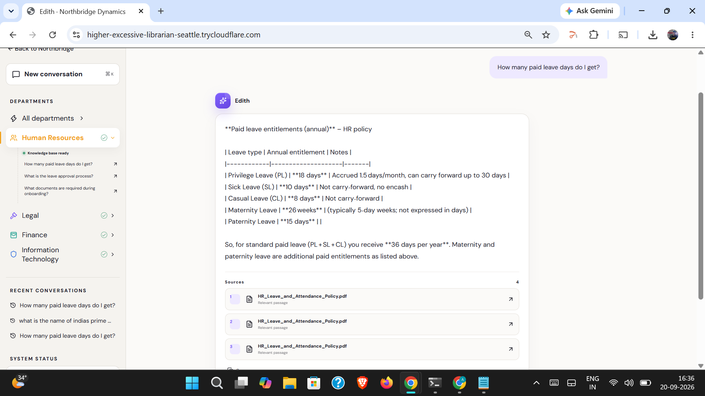
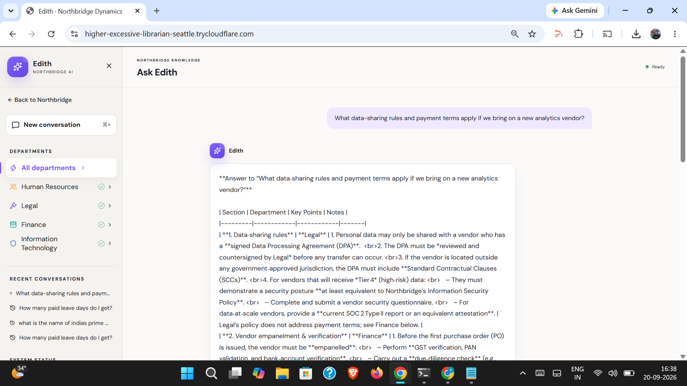
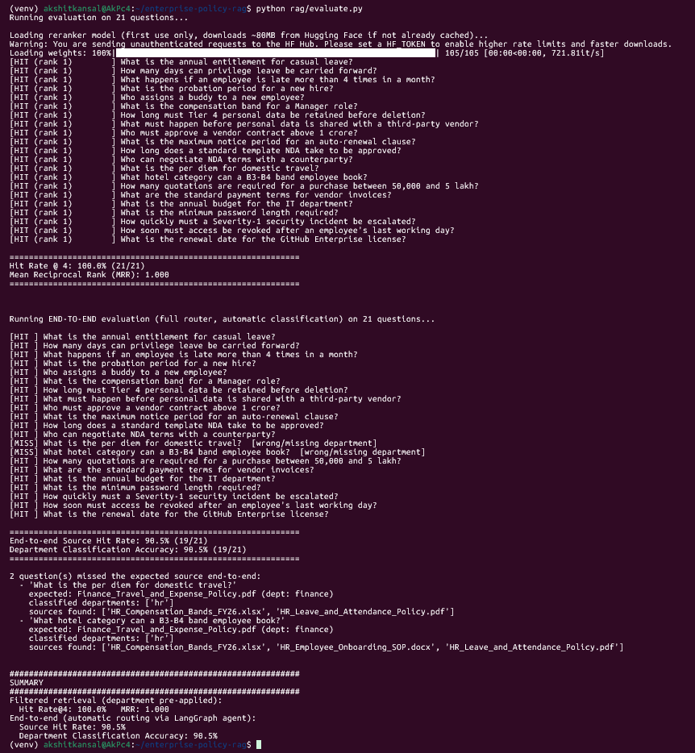

<div align="center">

# Enterprise Policy RAG — Edith

**A production-style, multi-department Retrieval-Augmented Generation system.**
Document ingestion → department-aware retrieval & reranking → LangGraph-driven
routing and cross-department synthesis → rigorous evaluation → full-stack deployment.

[](https://github.com/065008gif/enterprise-rag-platform)
[](https://enterprise-rag-platform-829933777976.asia-south1.run.app/)
[](https://www.python.org/)
[](./frontend)
[](https://enterprise-rag-platform-829933777976.asia-south1.run.app/)

**Repository:** [github.com/065008gif/enterprise-rag-platform](https://github.com/065008gif/enterprise-rag-platform)
**Live demo:** [enterprise-rag-platform-829933777976.asia-south1.run.app](https://enterprise-rag-platform-829933777976.asia-south1.run.app/)

</div>

---

## Screenshots

<table>
<tr>
<td width="50%">

**Landing page**
<br>


</td>
<td width="50%">

**A real answer, with citations**
<br>


</td>
</tr>
<tr>
<td width="50%">

**Cross-department synthesis**
<br>


</td>
<td width="50%">

**Evaluation results**
<br>


</td>
</tr>
</table>

---

## What it does

Employees ask natural-language questions about company policy — leave
entitlements, vendor contract approval thresholds, data retention rules,
IT security policy, and more — spanning four departments (HR, Legal,
Finance, IT). The system:

- Automatically determines which department's documents are relevant,
  including questions that genuinely span **more than one** department
  (for example: *"what data-sharing rules and payment terms apply if we
  bring on a new analytics vendor?"* needs both Legal and Finance)
- Retrieves and reranks the most relevant document passages
- Synthesizes a single, coherent, cited answer — reconciling multiple
  departments' input when needed, and flagging when departments disagree
  or have nothing relevant to add
- **Honestly declines to answer** when a question is out of scope,
  rather than producing a hallucinated response

---

## Why this isn't a tutorial RAG demo

Most RAG tutorials stop at "embed documents, run a similarity search, ask
an LLM." This project implements several techniques used in production
retrieval systems, and — importantly — **measures** them.

| Technique | Implementation |
|---|---|
| Metadata-filtered retrieval (scope search to specific departments) | `rag/query_engine.py` |
| Cross-encoder reranking on top of vector similarity | `rag/query_engine.py` |
| LLM-driven automatic query routing (LangGraph agent) | `rag/router_agent.py` |
| Cross-department synthesis with per-source attribution | `rag/router_agent.py` |
| Grounded generation with explicit abstention | `rag/query_engine.py` |
| A real, hand-labeled evaluation harness | `rag/evaluate.py` |

### Evaluation results

Two-tier evaluation against 21 hand-labeled questions spanning all four
departments, deliberately isolating retrieval quality from routing
accuracy:

| Mode | Metric | Result |
|---|---|---|
| Filtered retrieval (department pre-specified) | Hit Rate@4 | **100.0%** (21/21) |
| Filtered retrieval (department pre-specified) | MRR | **1.000** |
| End-to-end (fully automatic routing) | Source Hit Rate | **95.2%** (20/21) |
| End-to-end (fully automatic routing) | Department Classification Accuracy | **95.2%** (20/21) |

The one end-to-end miss is interpretable, not noise: a question
containing the word "band" was routed to HR (compensation bands) instead
of Finance (travel-entitlement bands) — a genuine cross-department
terminology collision. Full breakdown in `rag/evaluate.py`.

---

## Architecture

```
Raw documents (PDF / DOCX / XLSX)
        │
        ▼
   Docling parser        ──►  clean Markdown, tables & headings preserved
        │
        ▼
Heading-aware chunker     ──►  tagged chunks (department, doc type,
        │                       doc code, effective date, section)
        ▼
Hugging Face Inference API embedding (all-MiniLM-L6-v2)
        │
        ▼
   Qdrant vector store
        │
        ▼
┌──────────────────────────────────────────────┐
│  LangGraph router agent                       │
│  1. Classify department(s)  — LLM-driven      │
│  2. Retrieve per department (filtered)        │
│  3. Rerank (cross-encoder)                    │
│  4. Synthesize — single department or         │
│     cross-department reconciliation           │
└──────────────────────────────────────────────┘
        │
        ▼
   Ollama Cloud (gpt-oss:20b) for generation
        │
        ▼
   FastAPI REST API      ──►  React frontend ("Edith")
        │
        ▼
   Google Cloud Run (public deployment)
```

**Why local embeddings + a cloud LLM?** Ollama Cloud's free tier
currently has no hosted embedding models, so embeddings run locally via
a small, fast open-source model via the Hugging Face Inference API with
negligible cost, while answer generation uses Ollama Cloud's free tier —
a deliberate, documented tradeoff, not an oversight.

---

## Tech stack

| Layer | Technology |
|---|---|
| Parsing | [Docling](https://github.com/DS4SD/docling) — table- and layout-preserving PDF/DOCX/XLSX → Markdown |
| Chunking & retrieval | [LlamaIndex](https://www.llamaindex.ai/) |
| Vector store | [Qdrant Cloud](https://qdrant.tech/) |
| Agent orchestration | [LangGraph](https://www.langchain.com/langgraph) |
| LLM | Ollama Cloud (`gpt-oss:20b`) |
| Embeddings | Hugging Face Inference API (`sentence-transformers/all-MiniLM-L6-v2`) |
| Backend | FastAPI |
| Frontend | React + Vite |
| Deployment | Google Cloud Run |

---

## Project structure

```
enterprise-rag-platform/
├── digest/                    # Document ingestion pipeline
│   ├── parse_documents.py     # Docling: raw docs -> Markdown
│   ├── chunk_documents.py     # Heading-aware chunking + metadata tagging
│   └── embed_and_upsert.py    # Embed + upsert into Qdrant
├── rag/                       # Core RAG engine
│   ├── config.py               # Central config (models, hosts, departments)
│   ├── query_engine.py         # Filtered retrieval + reranking + grounded synthesis
│   ├── router_agent.py         # LangGraph: auto department routing + cross-dept synthesis
│   ├── evaluate.py             # Two-tier retrieval evaluation harness
│   └── app.py                  # FastAPI backend
├── frontend/                  # React frontend ("Edith")
├── data/                      # Sample documents (generated artifacts are gitignored)
├── docker-compose.yml
├── Dockerfile
└── requirements.txt
```

---

## Running it yourself

**Prerequisites:** Python 3.11+, Docker, Node.js 18+, free accounts on
[Ollama Cloud](https://ollama.com), [Qdrant Cloud](https://cloud.qdrant.io),
and [Hugging Face](https://huggingface.co).

```bash
# Clone and set up the environment
git clone https://github.com/065008gif/enterprise-rag-platform.git
cd enterprise-rag-platform
python3 -m venv venv
source venv/bin/activate
pip install -r requirements.txt

# Configure your API keys and Qdrant Cloud connection
cat > .env << 'EOF'
OLLAMA_API_KEY=your_ollama_key_here
QDRANT_URL=your_qdrant_cloud_url_here
QDRANT_API_KEY=your_qdrant_key_here
HUGGINGFACE_API_KEY=your_huggingface_key_here
EOF

# Run the ingestion pipeline
python digest/parse_documents.py
python digest/chunk_documents.py
python digest/embed_and_upsert.py

# Build the frontend
cd frontend && npm install && npm run build && cd ..

# Run the backend locally
uvicorn rag.app:app --host 0.0.0.0 --port 8000
```

Then open **http://localhost:8000**.

---

## Deployment

The application is containerized (FastAPI backend + built React frontend,
served together) and deployed on **Google Cloud Run**, with document
embeddings and vector search running on **Qdrant Cloud** and text
embeddings generated via the **Hugging Face Inference API** — fully
managed, no self-hosted infrastructure required. The service is live at
**[enterprise-rag-platform-829933777976.asia-south1.run.app](https://enterprise-rag-platform-829933777976.asia-south1.run.app/)**.

Cloud Run scales to zero when idle, so the first request after a period
of inactivity may take up to a minute while the container starts and
loads the reranking model; subsequent requests are fast.

Verified working from a mobile device on cellular data (not the same
network as any development machine), confirming genuine public
reachability.

---

## About

Built end-to-end by Akshit Kansal — architecture, retrieval pipeline,
evaluation harness, and cloud deployment.
